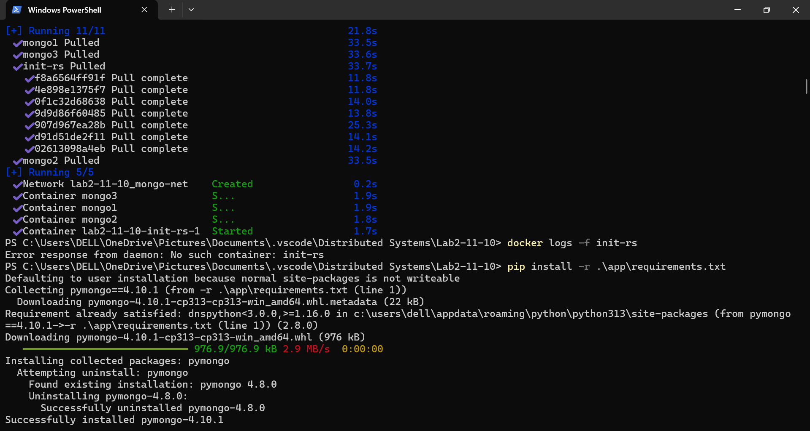
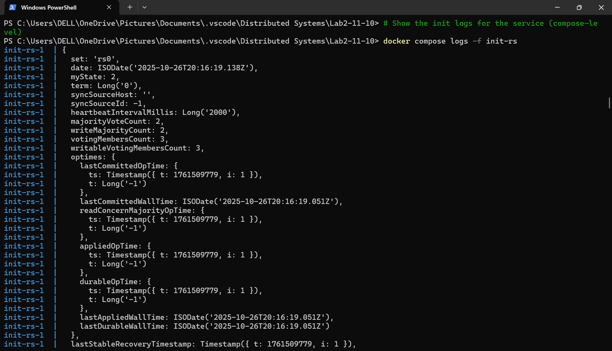
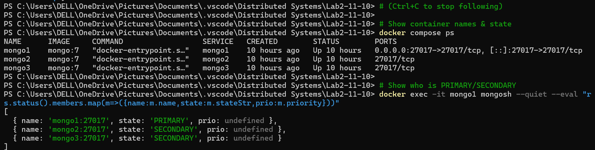
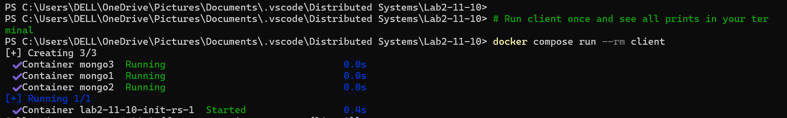
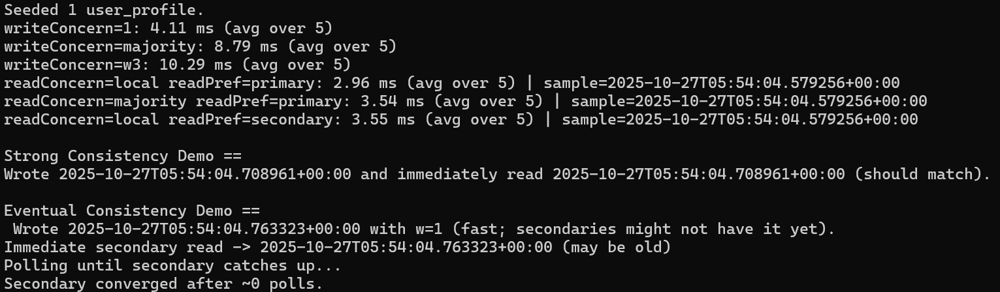

Lab 2 — MongoDB Replica Set with Python Client - Saniya Bhargava - 24241014

This repository explains the project I have built that includes a 3-node MongoDB replica set with Docker Compose and uses a small Python client to run replication and consistency experiments.

Repository Structure
.
├─ docker-compose.yml
├─ init/
│  └─ rs-init.js
├─ app/
│  ├─ main.py
│  ├─ failover_probe.py   
│  └─ requirements.txt
├─ results/
│  ├─ reads.csv
│  └─ writes.csv
└─ README.md                

Quick Start

Start Docker Desktop on Windows and ensure “Docker is running”.

From the repo root:

docker compose up -d
docker compose logs -f init-rs
docker exec -it mongo1 mongosh --quiet --eval "rs.status().members.map(m=>({name:m.name,state:m.stateStr,prio:m.priority}))"

You should see one PRIMARY and two SECONDARY.

Run the client inside the Docker network:

docker compose run --rm client

This prints write/read latencies, runs the strong and eventual consistency demos, and saves CSVs to results/.

Optional failover demonstration (primary election):

docker stop mongo1
docker exec -it mongo2 mongosh --quiet --eval "rs.isMaster()"
docker exec -it mongo3 mongosh --quiet --eval "rs.isMaster()"
docker start mongo1

Full Lab Report

Introduction

Purpose. The goal of this lab is to design a small replicated database setup, run controlled experiments to observe consistency and availability behavior, and connect those findings to architectural trade-offs emphasized in distributed systems, particularly the CAP theorem. The experiments compare strong-ish settings in MongoDB (majority write and majority read on the primary) to relaxed settings (w=1 write, reading from a secondary), and examine system behavior during a primary failure and election.

Chosen database and tooling. I selected MongoDB Community Edition in a 3-node replica set, orchestrated with Docker Compose. The client is a lightweight Python script using pymongo. This combination is simple enough to run on a student laptop while still exposing authentic replication, consistency, and failover behaviors.

Setup and Configuration
Topology

Replica Set Name: rs0

Nodes: 3 MongoDB containers

mongo1 (preferred primary via higher priority)

mongo2 (secondary)

mongo3 (secondary)

Client: A small Python program executing inserts/updates and reads with different concerns.

+-----------+         replication (async)          +-----------+
|  mongo1   |  <------------------------------->   |  mongo2   |
| PRIMARY   |                                      | SECONDARY |
+-----------+                                      +-----------+
      |                                                 ^
      | replication (async)                             |
      v                                                 |
+-----------+                                           |
|  mongo3   |  <----------------------------------------+
| SECONDARY |
+-----------+

Client container (python:3.13) runs in the same Docker network, connects to
"mongo1:27017,mongo2:27017,mongo3:27017/?replicaSet=rs0"

Docker Compose (excerpt)

Three mongod services launched with --replSet rs0.

An init container (init-rs) runs a small script to call rs.initiate(...).

A client service (python image) mounts app/ and results/, installs pymongo, and runs the experiments.

Why run the client inside the Docker network

Replica set member hostnames (mongo1, mongo2, mongo3) are internal to the Docker network. If the client runs on the Windows host and discovers these names from the replica set, it will then try to use them and fail to resolve. Running the client inside the Compose network resolves this cleanly, matching a real microservice in the same network segment.

Reproducibility commands
docker compose up -d
docker compose logs -f init-rs
docker exec -it mongo1 mongosh --quiet --eval "rs.status()"
docker compose run --rm client

Replication and Consistency Experiments
Experiment Matrix

Write concerns: w=1, w=majority, w=3 (all members)

Read concerns & preferences:

(rc=local, rp=primary)

(rc=majority, rp=primary)

(rc=local, rp=secondary)

Demos:

Strong consistency demo: w=majority write + rc=majority read on primary.

Eventual consistency demo: w=1 write + immediate read on secondary, polling for convergence.

Failover: Stop the primary, observe election and any temporary unavailability.

Evidence (console output)

From an actual run in this setup:

Writes (average over 5):

w=1: ~4.11 ms

w=majority: ~8.79 ms

w=3: ~10.29 ms

Reads (average over 5):

(rc=local, rp=primary): ~2.96 ms

(rc=majority, rp=primary): ~3.54 ms

(rc=local, rp=secondary): ~3.55 ms

Strong demo:
Wrote timestamp T and immediately read the same T from the primary with rc=majority.

Eventual demo:
After a w=1 write, the first secondary read already showed the new value. The script recorded convergence after ~0 polls. On a small local cluster the replication delay can be negligible, so this still demonstrates eventual consistency but with instantaneous convergence.

## Evidence (Screenshots)

### 1) Compose Pull and Startup
  
Caption: `docker compose up -d` pulling MongoDB and init images.

### 2) Compose Services Running
  
Caption: All services created and running (network, mongo1, mongo2, mongo3, init-rs).

### 3) Replica Set Initialization (Init Logs)
  
Caption: `docker compose logs -f init-rs` shows `rs.status()` output; replica set already initialized.

### 4) Members and Roles (PRIMARY/SECONDARY)
  
Caption: `docker compose ps` and `rs.status().members.map(...)` confirming one PRIMARY and two SECONDARY.

### 5) Client Start
  
Caption: `docker compose run --rm client` launches the Python client inside the same Docker network.

### 6) Client Results (Latencies + Demos)
  
Caption: Average write/read latencies and both Strong and Eventual consistency demonstrations in one run.

Observations and Analysis

Write concern vs latency.
Increasing write concern increases latency because the client waits for more acknowledgments:

w=1 returns after the primary persists the write → fastest.

w=majority returns after a quorum persists the write → slower.

w=3 (all members) returns after every member persists the write → slowest of the three.

Read concern and preference.

(rc=local, rp=primary) is generally fast and fresh because reads come from the leader.

(rc=majority, rp=primary) adds slightly more overhead but strengthens the guarantee that the read reflects acknowledged majority writes.

(rc=local, rp=secondary) is where staleness can appear right after w=1 writes due to asynchronous replication. In practice, on small setups, this staleness window may be so small that the first secondary read already sees the write.

Strong demo result.
Using w=majority for the write and rc=majority for the read from the primary makes the write visible immediately to the read. This is the stronger, more conservative setting.

Eventual demo result.
With w=1 writes and reading from a secondary, one should expect a window where the secondary is behind. On this cluster, the window was effectively zero due to very fast local replication. The key point remains: visibility on secondaries is not guaranteed until replication catches up.

Failover and availability.
Stopping the primary triggers an election. During this period, writes to the old primary fail or block briefly. Once a new primary is elected, writes succeed again. This illustrates a CAP trade-off: to preserve consistency and partition tolerance, the system sacrifices availability during leader election.

Architectural Trade-offs and When to Choose Each Setting

Linking back to CAP: in the presence of network partitions, a system can provide at most two of Consistency, Availability, and Partition tolerance. MongoDB’s replica set, when configured with majority writes/reads, prioritizes Consistency and Partition tolerance. During failover or partitions, there may be a short availability drop.

Strong-ish path (w=majority, rc=majority, primary reads).

Pros: Better guarantees that once a client sees a write acknowledged by the majority, subsequent majority reads will observe it. Safer for critical data.

Cons: Higher latency and potential write unavailability during partitions or elections.

Use when: Account balances, order placement confirmations, inventory decrements on checkout, authentication critical paths, regulatory records.

Relaxed path (w=1, secondary reads).

Pros: Lower latency and higher throughput. Reads can be offloaded from the primary; system feels more responsive.

Cons: Potentially stale reads shortly after writes; observing non-monotonic changes is possible.

Use when: Activity feeds, counters where exact accuracy is not immediately critical, dashboards that can tolerate slightly stale data, product browsing pages where price/stock is eventually refreshed before purchase.

Mixing strategies.
Many real systems use mixed settings: majority writes on critical collections and lower concerns on non-critical features, or route read traffic to secondaries for heavy, non-critical analytics while keeping transactional reads on the primary.

Distributed Transactions (Conceptual)
Scenario: E-commerce Order Workflow

A typical order pipeline may involve multiple services and data stores: Orders, Payments, Inventory, Shipping, and Notifications. Two broad approaches are considered:

ACID Transactions Across Services

Idea: Coordinating a single atomic transaction across multiple resources (e.g., 2-Phase Commit).

Benefits: All-or-nothing guarantee; makes reasoning simple.

Costs: Coordination overhead, increased latency, and reduced availability under failures. Coordinator and participants become failure points; complex recovery; poor fit for high-scale, partition-prone environments.

Saga Pattern

Idea: Split a long business transaction into a sequence of local transactions in each service, coordinated either by an orchestrator or by choreography via events. Each step has a compensating action to undo it if a subsequent step fails.

Orchestration: A central saga orchestrator calls service A → B → C and triggers compensations if needed. Easier to reason about control flow; single place to manage retries and timeouts.

Choreography: Services publish/subscribe to events and react independently. This removes the central controller but can be harder to reason about end-to-end flow.

Benefits: High availability, naturally partition-tolerant, services remain loosely coupled, better performance under load.

Costs: Eventual consistency by design; you must implement compensations and handle out-of-order messages and retries; debugging requires robust correlation IDs and observability.

When to Choose Which

ACID across services only when the transactional boundary truly spans resources that must be atomically consistent at all times, and when the system can tolerate the coordination overhead and reduced availability.

Saga for most internet-scale e-commerce flows: reserve inventory, charge payment, create shipment, and notify user, with compensations like releasing inventory or refunding payment if later steps fail. This aligns with the high-availability requirement and the acceptance of short windows of eventual consistency.

Conclusion

This lab showed that even a small three-node replica set exhibits the real trade-offs taught in class. Majority writes and reads improve visibility guarantees at the cost of higher latency and temporary unavailability during elections. Relaxed settings are faster and scale better for read-heavy workloads but accept short windows of staleness. The failover demo made the CAP trade-off tangible: to keep consistent behavior after a failure, the system accepts a brief period where new writes are not available. For multi-service workflows, the conceptual comparison of ACID and Sagas clarified why most large systems adopt Saga-style coordination: availability and scale outweigh the complexity cost, and eventual consistency can be managed with compensations and good observability.

Source Code Repository Link

Repository link: https://github.com/<your-username>/<your-repo-name>

Appendix: Commands Reference
# Start everything
docker compose up -d

# Watch init logs
docker compose logs -f init-rs

# Check members and roles
docker exec -it mongo1 mongosh --quiet --eval "rs.status().members.map(m=>({name:m.name,state:m.stateStr,prio:m.priority}))"

# Run client experiments
docker compose run --rm client

# Failover (primary election)
docker stop mongo1
docker exec -it mongo2 mongosh --quiet --eval "rs.isMaster()"
docker exec -it mongo3 mongosh --quiet --eval "rs.isMaster()"
docker start mongo1

# If port 27017 is occupied on host (rarely needed for this setup)
netstat -ano | findstr 27017
taskkill /PID <PID> /F

Notes on Reproducing Results 

Numbers will vary slightly by machine and background CPU load. The relative ordering should remain: w=1 is fastest, w=majority slower, w=3 slowest; primary reads are fast; majority reads add small overhead; secondary reads may be stale but often converge quickly in a local cluster.

If you need a visible stale read window, increase write frequency and immediately read from the secondary in a tighter loop, or add artificial delay in replication (not recommended for grading).