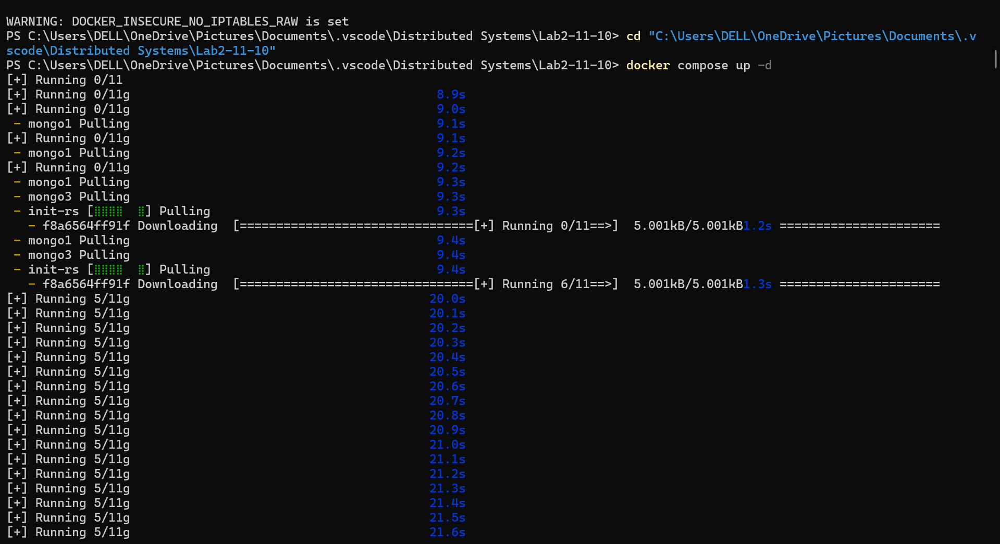

# **Lab 2 — MongoDB Replica Set with Python Client**  
**Saniya Bhargava — Student ID: 24241014**

---

## **Overview**

This repository explains the project I have built that includes a **3-node MongoDB replica set** using **Docker Compose**, along with a small **Python client** to run replication and consistency experiments.

---

## **Repository Structure**

```bash
.
├─ docker-compose.yml
├─ init/
│ └─ rs-init.js
├─ app/
│ ├─ main.py
│ ├─ failover_probe.py
│ └─ requirements.txt
├─ results/
│ ├─ reads.csv
│ └─ writes.csv
└─ README.md
```
---

## **Quick Start**

### **Start Services**

Ensure **Docker Desktop** is running on Windows.

```bash
docker compose up -d
docker compose logs -f init-rs
docker exec -it mongo1 mongosh --quiet --eval \
"rs.status().members.map(m=>({name:m.name,state:m.stateStr,prio:m.priority}))"
You should see one PRIMARY and two SECONDARY nodes.
```

Run the Client
```bash
Copy code
docker compose run --rm client
This prints write/read latencies, runs the strong & eventual consistency demos,
and saves CSVs to /results/.
```
Optional — Simulate Failover
```bash
Copy code
docker stop mongo1
docker exec -it mongo2 mongosh --quiet --eval "rs.isMaster()"
docker exec -it mongo3 mongosh --quiet --eval "rs.isMaster()"
docker start mongo1
```
## Full Lab Report

---

### 1. Introduction

**Purpose**  
The goal of this lab is to design a small replicated database setup, run controlled experiments to observe **consistency** and **availability**, and connect the findings to the **CAP theorem**.

**The experiments compare:**
- **Strong settings:** majority write + majority read on primary  
- **Relaxed settings:** w = 1 write + secondary reads  
- **System behavior:** during a primary failure and election  

**Chosen Database and Tooling**
- MongoDB Community Edition (3-node replica set)
- Docker Compose for orchestration
- Python (pymongo) client for experiments

---

### 2. Setup and Configuration

#### Topology

**Replica Set Name:** `rs0`

**Nodes**
- mongo1 – Primary (higher priority)
- mongo2 – Secondary
- mongo3 – Secondary

**Client**  
Executes inserts, updates, and reads with different read/write concerns.

```

+-----------+         replication (async)          +-----------+
|  mongo1   |  <------------------------------->   |  mongo2   |
| PRIMARY   |                                      | SECONDARY |
+-----------+                                      +-----------+
|                                                 ^
| replication (async)                             |
v                                                 |
+-----------+                                           |
|  mongo3   |  <----------------------------------------+
| SECONDARY |
+-----------+

````

**Client Container**  
Runs inside the same Docker network, connecting to:  
`mongo1:27017,mongo2:27017,mongo3:27017/?replicaSet=rs0`

---

#### Docker Compose Overview
- 3 `mongod` services with `--replSet rs0`
- `init-rs` container runs `rs.initiate()`
- Python client container mounts `/app` and `/results`, installs pymongo, and runs experiments

---

#### Why Run the Client Inside Docker Network
- Replica set hostnames (`mongo1`, `mongo2`, `mongo3`) exist only inside the Docker network  
- Running the client outside would cause DNS failures  
- Running it inside mirrors a real microservice deployment

---

#### Reproducibility Commands

```bash
docker compose up -d
docker compose logs -f init-rs
docker exec -it mongo1 mongosh --quiet --eval "rs.status()"
docker compose run --rm client
````

---

### 3. Replication and Consistency Experiments

#### Experiment Matrix

| Category                        | Variants Tested                                                                         |
| ------------------------------- | --------------------------------------------------------------------------------------- |
| **Write Concerns**              | w = 1, w = majority, w = 3                                                              |
| **Read Concerns & Preferences** | (rc = local, rp = primary), (rc = majority, rp = primary), (rc = local, rp = secondary) |

**Demos**

* Strong consistency → w = majority, rc = majority, primary read
* Eventual consistency → w = 1, secondary read
* Failover → primary shutdown and election

---

#### Observed Console Output

**Write latencies (average of 5):**

* w = 1 → 4.11 ms
* w = majority → 8.79 ms
* w = 3 → 10.29 ms

**Read latencies (average of 5):**

* (rc = local, rp = primary) → 2.96 ms
* (rc = majority, rp = primary) → 3.54 ms
* (rc = local, rp = secondary) → 3.55 ms

---

### 4. Evidence (Screenshots)

#### 1. Compose Pull and Startup
  
*`docker compose up -d` pulling MongoDB and init images.*

---

#### 2. Compose Services Running
  
*All containers created and running (network, mongo1, mongo2, mongo3, init-rs).*

---

#### 3. Replica Set Initialization (Init Logs)
  
*Replica set initialized successfully via `docker compose logs -f init-rs`.*

---

#### 4. Members and Roles
  
*`rs.status().members.map(...)` confirming one PRIMARY and two SECONDARY.*

---

#### 5. Client Start
  
*`docker compose run --rm client` executing Python client inside Docker network.*

---

#### 6. Client Results
  
*Average write/read latencies and both Strong + Eventual consistency demonstrations.*

---


### 5. Observations and Analysis

#### Write Concern vs Latency

* w = 1 → Fastest (primary only)
* w = majority → Moderate (quorum ack)
* w = 3 → Slowest (all nodes)

#### Read Concern and Preference

* Local reads from primary → fresh and fast
* Majority reads → safer but slower
* Secondary reads → may be stale

#### Failover and Availability

Primary failure → short election delay.
Trade-off between **Consistency + Partition tolerance** vs **Availability**.

---

### 6. Architectural Trade-Offs

| Setting                 | Pros                      | Cons                            | Best Use                     |
| ----------------------- | ------------------------- | ------------------------------- | ---------------------------- |
| **Strong (w=majority)** | Guaranteed consistency    | Higher latency / failover delay | Payments, auth, orders       |
| **Relaxed (w=1)**       | Low latency / scalable    | Possible stale reads            | Feeds, analytics, dashboards |
| **Hybrid**              | Balance of speed + safety | Slightly more complexity        | Large production systems     |

---

### 7. Distributed Transactions (Conceptual)

#### Scenario: E-Commerce Workflow

Services: Orders | Payments | Inventory | Shipping | Notifications

---

#### A. ACID Across Services

* **Pros:** Atomic, consistent
* **Cons:** Slow, complex recovery
* **Use:** Rare cases requiring strict atomicity

---

#### B. Saga Pattern

* **Idea:** Local transactions with compensations
* **Styles:** Orchestration / Choreography
* **Pros:** Highly available, scalable
* **Cons:** Eventual consistency, compensation logic required
* **Use:** Most internet-scale e-commerce flows

---

### 8. Conclusion

This lab demonstrated the real-world impact of **CAP trade-offs**:

* Majority writes improve consistency but reduce availability
* Relaxed settings increase throughput with minor staleness
* Failover showed temporary unavailability for consistency
* Saga pattern offers a practical balance for distributed transactions

---

### Source Code Repository

[https://github.com/saniyabhargava/comp41720-lab2-mongodb-replica-set](https://github.com/saniyabhargava/comp41720-lab2-mongodb-replica-set)

---

### Appendix — Command Reference

```bash
# Start everything
docker compose up -d

# Watch init logs
docker compose logs -f init-rs

# Check replica status
docker exec -it mongo1 mongosh --quiet --eval \
"rs.status().members.map(m=>({name:m.name,state:m.stateStr,prio:m.priority}))"

# Run client
docker compose run --rm client

# Failover demo
docker stop mongo1
docker exec -it mongo2 mongosh --quiet --eval "rs.isMaster()"
docker exec -it mongo3 mongosh --quiet --eval "rs.isMaster()"
docker start mongo1

# Free port (if needed)
netstat -ano | findstr 27017
taskkill /PID <PID> /F
```

---

### Notes on Reproducing Results

* Results vary slightly by CPU load
* Relative ordering remains: w=1 fastest → w=majority → w=3
* Primary reads fastest; secondary reads may lag briefly
* To observe visible staleness, increase write frequency or delay replication (demo only)


